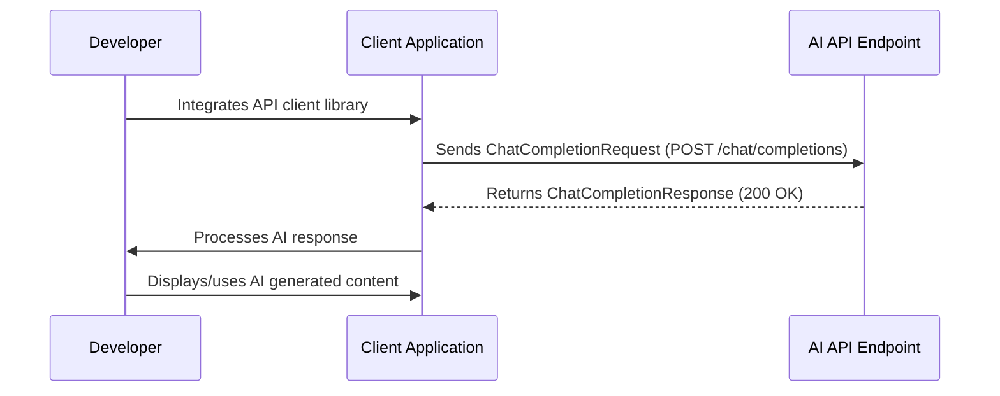

```mermaid
sequenceDiagram
    participant Dev as Developer
    participant Client as Client Application
    participant API as AI API Endpoint

    Dev->>Client: Integrates API client library
    Client->>API: Sends ChatCompletionRequest (POST /chat/completions)
    API-->>Client: Returns ChatCompletionResponse (200 OK)
    Client->>Dev: Processes AI response
    Dev->>Client: Displays/uses AI generated content
```
