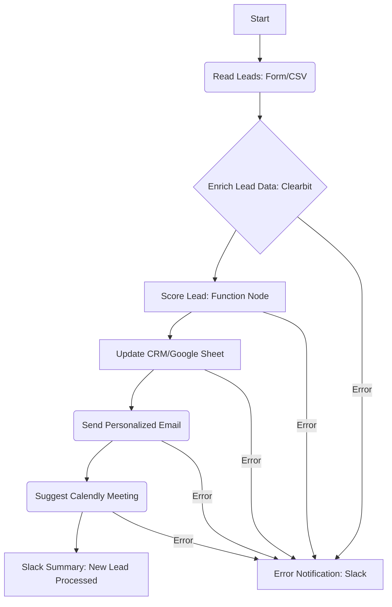

```mermaid
graph TD
    A[Start] --> B(Read Leads: Form/CSV)
    B --> C{Enrich Lead Data: Clearbit}
    C --> D[Score Lead: Function Node]
    D --> E[Update CRM/Google Sheet]
    E --> F(Send Personalized Email)
    F --> G(Suggest Calendly Meeting)
    G --> H[Slack Summary: New Lead Processed]
    C -- Error --> I[Error Notification: Slack]
    D -- Error --> I
    E -- Error --> I
    F -- Error --> I
    G -- Error --> I
```
